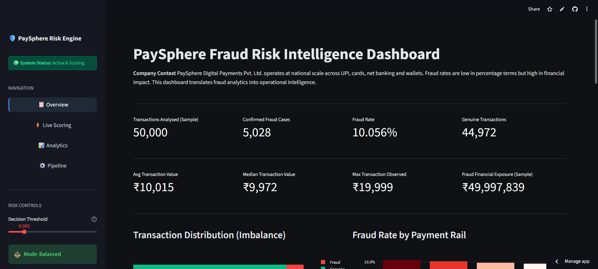

# 🛡️ PaySphere: Enterprise Fraud Risk Microservice


An asynchronous, decoupled machine learning microservice architecture designed to detect high-frequency payment fraud (UPI, Cards, Wallets) using **Vectorized Batch Inference** and **Explainable AI (XAI)**.

---

## 🏗️ System Architecture: The Decoupled Approach

Unlike standard monolithic ML projects, PaySphere is architected as a **distributed system** to mimic a real-world production environment.


### 1. The Brain (Inference API)
A **FastAPI** service hosted on **Render**. It serves a unified Scikit-Learn pipeline, handling:
- **Real-time Scoring:** Single-row latency optimized for checkout flows.
- **Vectorized Batching:** A dedicated endpoint that reduced dashboard loading from **45s to 1.8s** by eliminating the N+1 API request problem.

### 2. The Face (Risk Dashboard)
A **Streamlit** application hosted on **Streamlit Cloud**. It consumes the API to provide:
- **Executive KPIs:** Outlier analysis and financial risk distribution.
- **Explainable AI:** Real-time Waterfall charts showing feature-level mathematical drivers for every decision.

### 3. The Governance (Logging & Tests)
- **Structured Logging:** A `logging.yaml` configuration with dual-handlers for console and file-based "Fraud Audit Trails."
- **Pytest Suite:** 100% pass rate on core logic, including **Data Leakage Protection** tests for velocity features.

---

## 🖥️ Dashboard Features



1. **Executive Overview:** High-level fraud KPIs and log-scaled financial outlier detection.
2. **Live Scoring:** Simulate transactions with real-time API feedback and **Waterfall XAI** explaining the "Why" behind every score.
3. **Analytics:** High-speed scoring of 500+ transactions with Precision-Recall curves and Financial Cost-Benefit Simulators. 
4. **Pipeline:** Live inspection of the production artifact status, algorithm metadata, and feature counts.

---

## 🧱 Project Architecture

```text
fraud-detection-paysphere/
├── app/
│   ├── app.py                  # Main Streamlit entrypoint (router)
│   ├── overview_view.py        # Executive KPIs & Outlier Analysis
│   ├── live_view.py            # Live scoring with Explainable AI (Waterfall)
│   ├── analytics_view.py       # ML Curves, Feature Drivers & Fin-Simulator
│   ├── pipeline_view.py        # Architecture details & Model Registry
│   ├── ui_components.py        # Native Streamlit card components & styling
│   └── api.py                  # FastAPI Endpoints & Pydantic Contracts
├── config/
│   ├── config.yaml             # Data paths, model, threshold config
│   └── logging.yaml            # Logging configuration
├── data/
│   ├── raw/                    # Input dataset (synthetic)
│   ├── interim/                # Cleaned data
│   └── processed/              # Features + predictions (test set)
├── models/
│   ├── artifacts/
│       └── fraud_pipeline.joblib  # Unified .joblib Pipeline Registry
├── notebooks/
│   ├── 01_eda.ipynb            # Exploratory Data Analysis
│   ├── 02_feature_dev.ipynb    # Feature Engineering
│   └── 03_threshold_tuning.ipynb  # Features + predictions (test set)
├── src/
│   ├── data_ingestion/         # Load + validate + clean data
│   ├── features/               # Feature engineering + SMOTE
│   ├── modeling/               # Training pipeline & Inference Scorer
│   ├── pipeline/               # CLI entry to run full pipeline
│   ├── utils/                  # IO, schema validation, config utils
│   ├── logger.py               # Structured logging
│   └── exceptions.py           # Custom exception types
├── tests/                      # Pytest unit tests
├── requirements.txt
└── README.md
```

---

## 🧠 Technical Performance Highlights

- **Leakage-Proof Engineering**: Velocity features (`txn_count_last_24h`) use expanding windows and `.shift()` to ensure the model never "peeks" into the future during training.

- **Unified Pipelines**: Preprocessing (Scaling/Encoding) is baked into the `.joblib` artifact, ensuring 0% training-serving skew.

- **Imbalance Mastery**: Utilized SMOTE and prioritized Precision-Recall AUC over Accuracy to handle the 0.5% fraud minority class.

---

## 📦 Run It Locally
1️⃣ **Clone & Install Dependencies**

```bash
git clone [https://github.com/](https://github.com/)<your-username>/fraud-detection-paysphere.git

cd fraud-detection-paysphere

python -m venv .venv

source .venv/bin/activate  # Windows: .venv\Scripts\activate

pip install -r requirements.txt
```

2️⃣ **Execute the ML Pipeline (Train the Model)**

```bash
python -m src.pipeline.run_pipeline
```
This will ingest data, engineer features, apply SMOTE, train the classifier, and save the production artifacts to `/models/`.

3️⃣ Start the Backend (API)

```bash
# Serves the model at http://localhost:8000

python -m uvicorn src.api:app --reload
```

3️⃣ **Start the Frontend (UI)**

```bash
# Connects to the API for real-time scoring

streamlit run app/app.py
```

---

## 🧪 Testing
Run the automated test suite to verify feature engineering and inference logic:

```bash
pytest
```

---

## 📄 License

-
